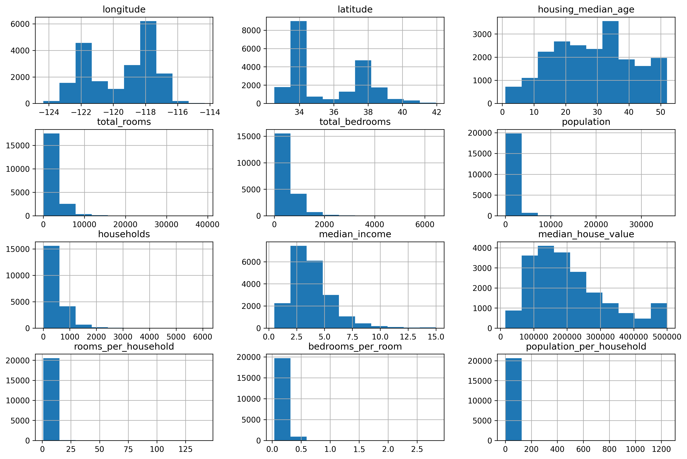
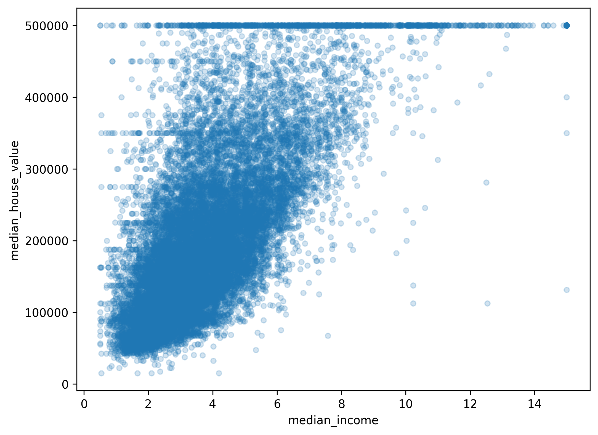
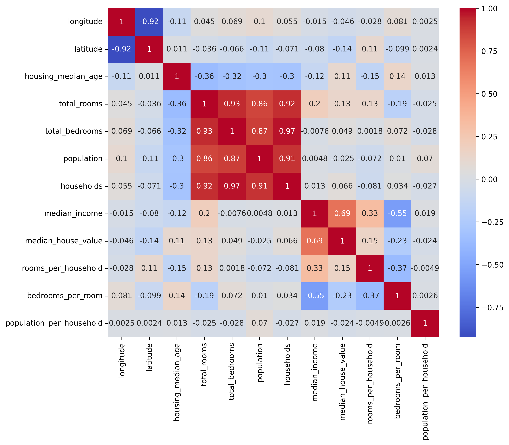

# 🏠 California House Price Prediction

A Machine Learning project that predicts California house prices using demographic and housing features. This project demonstrates the complete machine learning workflow, from data preprocessing and exploratory data analysis (EDA) to model training, evaluation, and comparison.

---

## 📌 Project Overview

The goal of this project is to predict the median house value of districts in California using various housing and geographical features. Multiple machine learning models were trained and compared to identify the best-performing model.

---

## 📊 Dataset

- **Dataset:** California Housing Dataset
- **Total Records:** 20,640
- **Features:** 10 original features
- **Target Variable:** `median_house_value`
- **Link:** https://www.kaggle.com/datasets/camnugent/california-housing-prices

### Features

- Longitude
- Latitude
- Housing Median Age
- Total Rooms
- Total Bedrooms
- Population
- Households
- Median Income
- Ocean Proximity
- Median House Value (Target)

---

## 🛠 Technologies Used

- Python
- Pandas
- NumPy
- Matplotlib
- Seaborn
- Scikit-learn
- Joblib
- Jupyter Notebook

---

## 📈 Exploratory Data Analysis (EDA)

The dataset was analyzed using:

- Dataset information and statistics
- Missing value analysis
- Correlation analysis
- Histograms

- Scatter plots

- Correlation heatmap


### Key Findings

- `median_income` showed the strongest positive correlation with house prices.
- Only the `total_bedrooms` column contained missing values.
- House prices were capped at \$500,000 in the dataset.
- Geographic location also influenced housing prices.

---

## ⚙️ Data Preprocessing

The preprocessing pipeline included:

- Handling missing values using Median Imputation
- Feature Scaling using StandardScaler
- One-Hot Encoding for categorical features
- Train-Test Split (80%-20%)

---

## ✨ Feature Engineering

Additional features created:

- Rooms per Household
- Bedrooms per Room
- Population per Household

These engineered features were evaluated as part of the experimentation process.

---

## 🤖 Models Used

### 1. Linear Regression

Performance:

- MAE: **50,670.74**
- RMSE: **70,060.52**
- R² Score: **0.6254**

---

### 2. Random Forest Regressor ⭐ (Best Model)

Performance:

- MAE: **32,339.10**
- RMSE: **50,363.60**
- R² Score: **0.8064**

Random Forest significantly outperformed Linear Regression and was selected as the final model.

---

## 📊 Model Comparison

| Model | MAE | RMSE | R² Score |
|-------|------:|------:|---------:|
| Linear Regression | 50,670.74 | 70,060.52 | 0.6254 |
| Random Forest Regressor | **32,339.10** | **50,363.60** | **0.8064** |

---

## 📁 Project Structure

```
house-price-prediction/
│
├── images/
│   ├── scatter_plot.png
│   └── correlation_heatmap.png
│
├── house_price_prediction.ipynb
├── housing.csv
├── requirements.txt
├── README.md
└── .gitignore
```

---

## 🚀 How to Run

1. Clone this repository

```bash
git clone https://github.com/MoonRaker07/house-price-prediction.git
```

2. Navigate to the project directory

```bash
cd house-price-prediction
```

3. Create a virtual environment (recommended)

```bash
python -m venv .venv
```

4. Activate the virtual environment

**Windows**

```bash
.venv\Scripts\activate
```

**macOS / Linux**

```bash
source .venv/bin/activate
```

5. Install the required packages

```bash
pip install -r requirements.txt
```

6. Launch Jupyter Notebook

```bash
jupyter notebook
```

7. Open `house_price_prediction.ipynb` and run all cells to reproduce the complete analysis and train the models.

---

## 📌 Note

The trained model (`.pkl` file) is intentionally **not included** in this repository because it exceeds GitHub's file size limit. You can regenerate the trained model at any time by running the notebook from start to finish.

---

## 📜 License

This project is for educational and portfolio purposes.

---

## 👨‍💻 Author

**Dhairya Sharma**

B.Tech in Artificial Intelligence & Machine Learning
Kurukshetra University

GitHub: https://github.com/MoonRaker07

LinkedIn: https://www.linkedin.com/in/dhairya-sharma-0509b1272

---